# Uni-app 踩坑日常

## 1. 自定义组件 image 的 src 路径

自定义组件里面使用 `<image>`时，若 `src` 使用相对路径可能出现路径查找失败的情况，故建议使用绝对路径。

—— [uni-app 文档 image 组件](https://uniapp.dcloud.io/component/image?id=image)

### 1.1 错误示范 ❌

```html
<image
      src="../../static/icos/star-yellow.png"
></image>
```

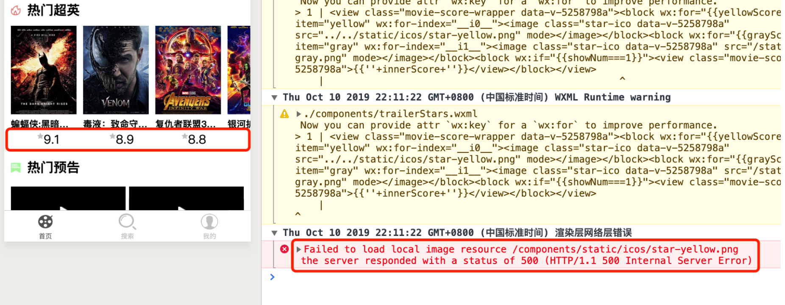

### 1.2 正确示范 ✅

```html
<image
      src="/static/icos/star-yellow.png"
></image>
```

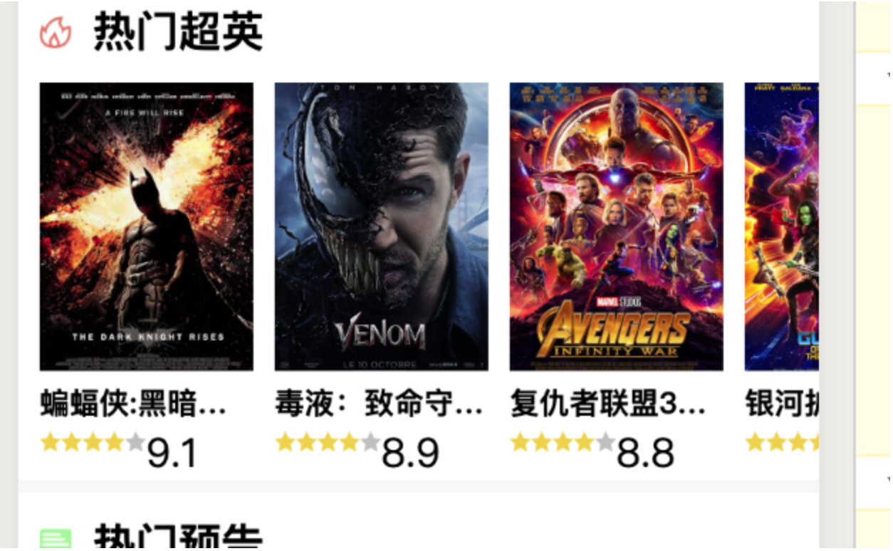

## 2. v-show 在小程序上不起作用

### 2.1 场景再现

希望通过点击按钮来切换三行文字的显示隐藏：

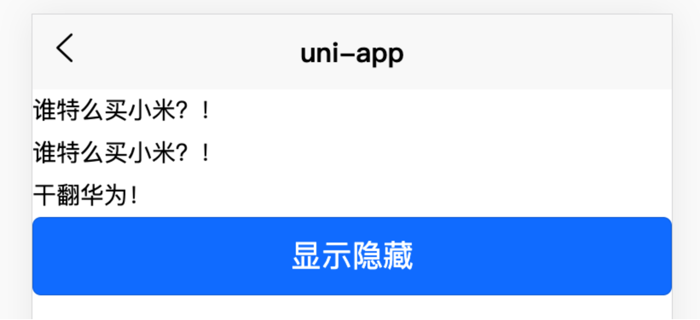

代码非常简单，但有两个条件：

- style 标签添加上 `scoped`
- 装填文字的容器有自己的 display 属性

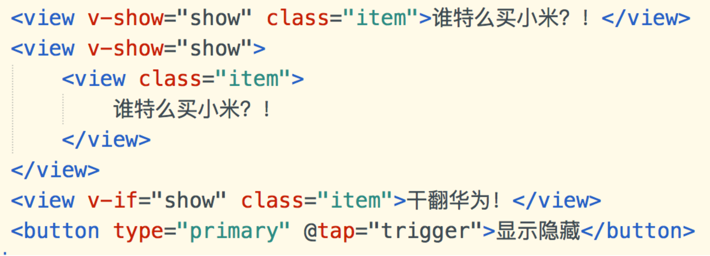
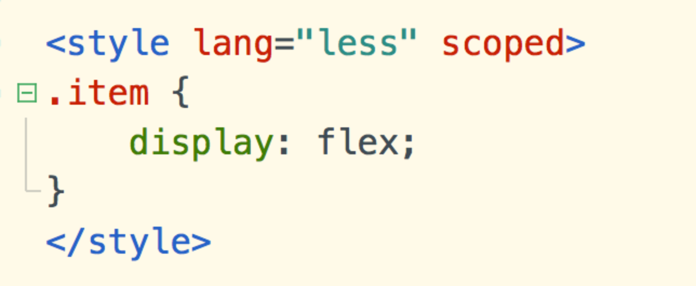

在此种情况下，H5的效果和预期一样，点击后三行文字都消失，再次点击三行文字都显示，如此往复。

但在微信小程序中第一行文字始终无法消失。

### 2.2 问题所在

在小程序中， .item.data-v-xxx 的样式覆盖掉了 view[hidden] 的样式：
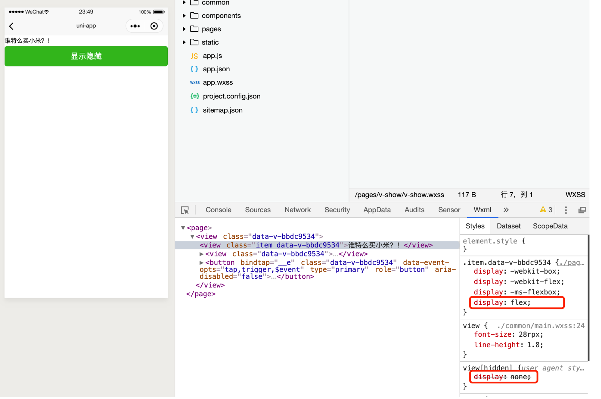

所以本应该默认不显示的第一行文字显示了。

------

而在 H5 上，uni-app 的做法是给当前标签添加上行内样式的 display: none，优先级最高：

```html
<view v-show="show">
	<view class="item">谁特么买小米？！</view>
</view>
```

### 2.3 解决办法

在外层包裹一个div，在上面设置 `v-show` 来控制元素的隐藏和显示：

## 3. uni-icon h5端不显示

在项目中使用 uni-app 官方提供的 uniIcon 组件时，要注意现有项目中使用的是 `uni-icon.vue` 还是 `uni-icons.vue` ，前者是旧版组件，后者是新版，多了个 `s` 后缀。

- 如果使用的前者，注意在页面中导入 `uni-icon` 时不要起名为 `uniIcon` ：

  ```javascript
  ❌import uniIcon from '@/components/uni-icon/uni-icon.vue'
  ```

  这样会导致 H5 端无法显示该图标。
  解决办法是起个别名，例如：

  ```javascript
  ✅import swIcon from '@/components/uni-icon/uni-icon.vue'
  ```

- 如果使用的后者，要注意使用 snippet 智能提示后，自动生成的代码 `<uni-icon type=""></uni-icon>` 是有错误的，标签名最后少了个 `s` ，正确写法是：

  ```html
  ✅<uni-icons class="apply" type="plusempty" size="20"></uni-icons>
  ```

### 3.1 三种情况比较：

```html
<uni-icon type="plusempty" size="20"></uni-icon>
<sw-icon type="plusempty" size="20"></sw-icon>
<uni-icons type="plusempty" size="20"></uni-icons>
```

```javascript
import uniIcon from '@/components/uni-icon/uni-icon.vue'
import swIcon from '@/components/uni-icon/uni-icon.vue'
import uniIcons from '@/components/uni-icons/uni-icons.vue'
```


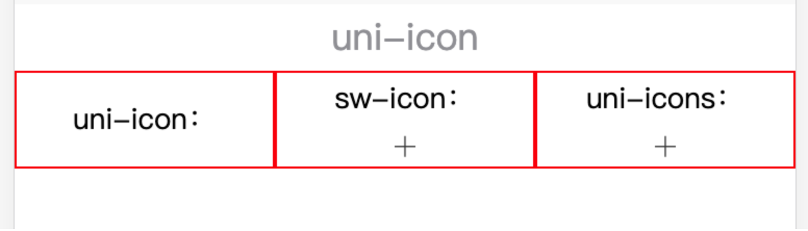

### 3.2 插件地址：

https://ext.dcloud.net.cn/plugin?id=28

## 4. 自定义modal弹窗

uni-app 自带的 [uni.showModal](https://uniapp.dcloud.io/api/ui/prompt?id=showmodal) API的主体内容不支持添加标签，只能添加文字：
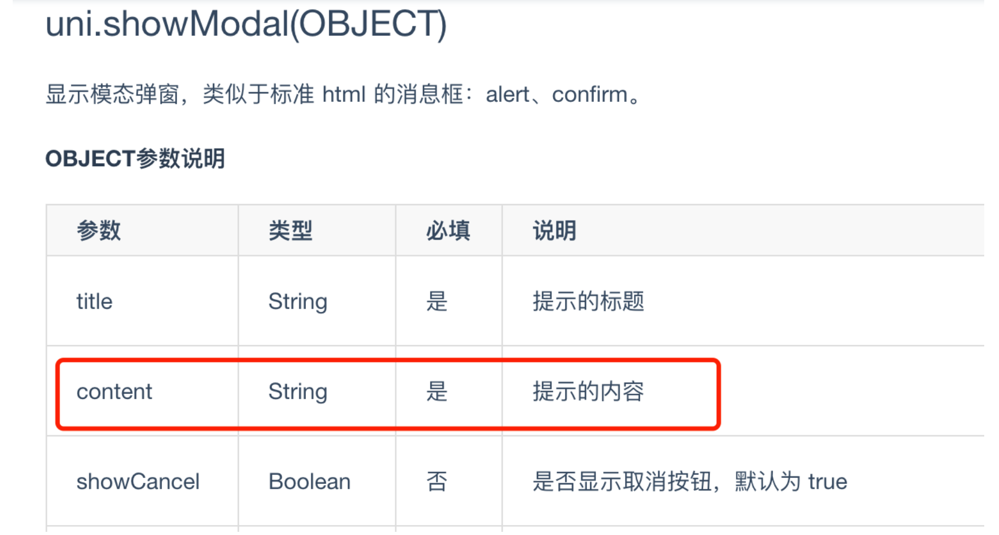
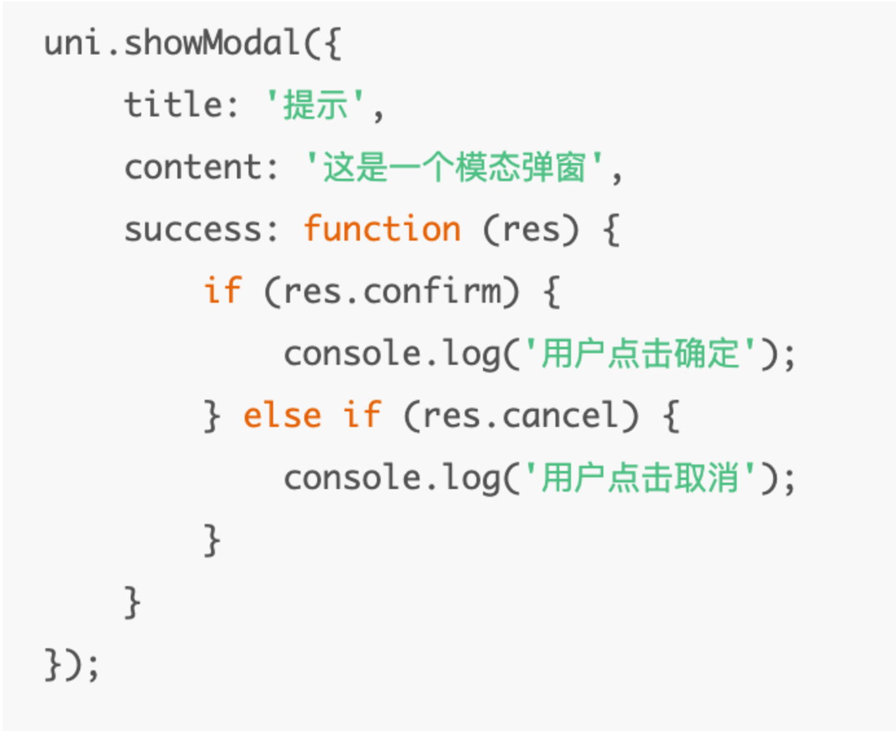

如果需要在弹窗中显示一个 input 控件或其他元素就无能为力了。

### 4.1 解决办法

在插件市场找到了一款自定义 modal 组件：

文档：https://ext.dcloud.net.cn/plugin?id=134

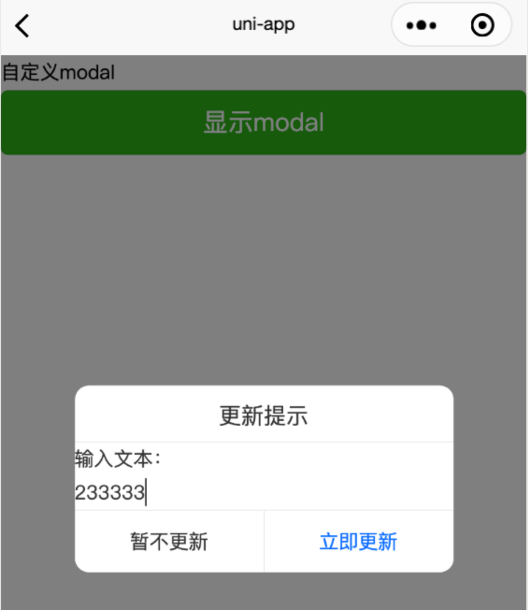

## 5. class数组对象形式绑定

非H5端不支持[Vue官方文档：Class 与 Style 绑定](https://cn.vuejs.org/v2/guide/class-and-style.html)中的`classObject`和`styleObject`语法。

—— [uni-app 文档](https://uniapp.dcloud.io/use?id=class-与-style-绑定)

### 5.1 H5

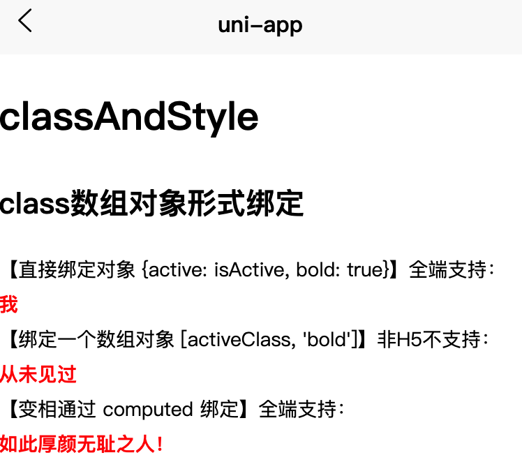

### 5.2 WX小程序

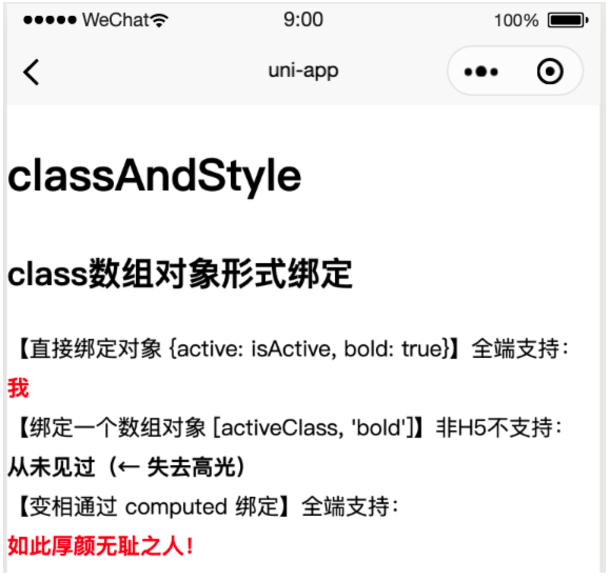

