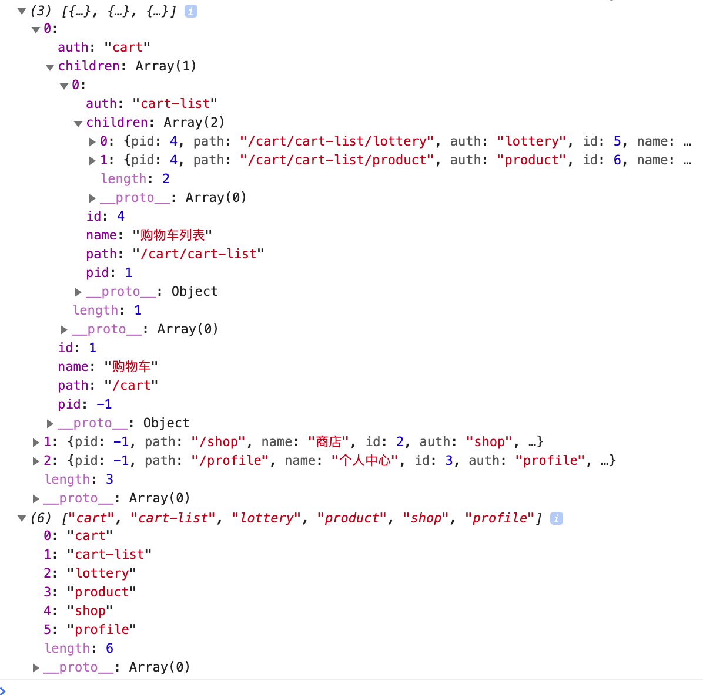

# 动态路由 + 路由鉴权

## 最终实现的菜单列表

```shell
个人中心  Profile.vue
商店     Shop.vue
购物车   Cart.vue
    └── 购物车列表    CartList.vue
       ├── 商品      Product.vue
       └── 彩票      Lottery.vue
```

## 后台返回的admin路由权限

```js
[
    {pid:-1,path:'/cart',name:'购物车',id:1,auth:'cart'},
    {pid:1,path:'/cart/cart-list',name:'购物车列表',id:4,auth:'cart-list'},
    {pid:4,path:'/cart/cart-list/lottery',auth:'lottery',id:5,name:'彩票'},
    {pid:4,path:'/cart/cart-list/product',auth:'product',id:6,name:'商品'},
    {pid:-1,path:'/shop',name:'商店',id:2,auth:'shop'},
    {pid:-1,path:'/profile',name:'个人中心',id:3,auth:'store'},
];
```

## 项目生成

```shell
vue create menu-auth
? Check the features needed for your project: 
 ◉ Babel
 ◉ Router
 ◉ Vuex
 history mode
 In dedicated config files
 Save this as a preset for future projects? (y/N) n
```

### 移除不必要的文件及其代码

- components/HelloWorld.vue
- views/About.vue
- views/Home.vue 中 .home 标签下所有内容，有关 HelloWorld.vue 相关代码
- App.vue 中 #app 下除 `router-view` 所有内容
- router.js 下有关 About.vue 相关代码

## 后端生成

根目录下创建 `server.js` 作为我们的服务端文件：

```js
let express = require('express');
let app = express();
// 在后端配置，让所有人都可以访问api接口 跨域问题
app.use('*', function (req, res, next) {
  res.header('Access-Control-Allow-Origin', '*');
  // Access-Control-Allow-Headers ,可根据浏览器的F12查看,把对应的粘贴在这里就行
  res.header('Access-Control-Allow-Headers', 'Content-Type');
  res.header('Access-Control-Allow-Methods', '*');
  res.header('Content-Type', 'application/json;charset=utf-8');
  next();
});
// 前端请求的路由API路径
app.get('/role', (req, res) => {
  res.json({
    //假如这是后端给我们的JSON数据
    menuList: [{
        pid: -1,
        path: '/cart',
        name: '购物车',
        id: 1,
        auth: 'cart'
      },
      {
        pid: 1,
        path: '/cart/cart-list',
        name: '购物车列表',
        id: 4,
        auth: 'cart-list'
      },
      {
        pid: 4,
        path: '/cart/cart-list/lottery',
        auth: 'lottery',
        id: 5,
        name: '彩票'
      },
      {
        pid: 4,
        path: '/cart/cart-list/product',
        auth: 'product',
        id: 6,
        name: '商品'
      },
      {
        pid: -1,
        path: '/shop',
        name: '商店',
        id: 2,
        auth: 'shop'
      },
      {
        pid: -1,
        path: '/profile',
        name: '个人中心',
        id: 3,
        auth: 'profile'
      },
    ],
    buttonAuth: {
      edit: true, // 可编辑
    }
  })
})
//监听3000端口
app.listen(3000)
```

终端 `node server.js` 启动，或者使用 `nodemon server.js` 热启动。

## 新建路由所需相关文件

components/menu/ 文件下新建：

> cart-list.vue

```html
<template>
  <div>
    cart-list
    <router-view></router-view>
  </div>
</template>

<script>
  export default {}
</script>

<style>
</style>
```

> cart.vue

```js
<template>
  <div>
    cart
    <router-view></router-view>
  </div>
</template>

<script>
  export default {
    name: 'cart'
  }
</script>

<style>
</style>
```

> lottery.vue

```html
<template>
  <div>
    lottery
  </div>
</template>

<script>
  export default {}
</script>

<style>
</style>
```

> product.vue

```html
<template>
  <div>
    product
  </div>
</template>

<script>
  export default {}
</script>

<style>
</style>
```

> profile.vue

```html
<template>
  <div>
    profile
  </div>
</template>

<script>
  export default {}
</script>

<style>
</style>
```

> shop.vue

```html
<template>
  <div>
    shop
  </div>
</template>

<script>
  export default {}
</script>

<style>
</style>
```

最后来一个 404 页面，放在 `views/` 文件夹下：

```html
<template>
  <div>
    404
  </div>
</template>

<script>
  export default {}
</script>

<style>
</style>
```

## 配置路由

来到 `router.js` 文件配置路由表：

```js
import Vue from 'vue'
import Router from 'vue-router'
import Home from './views/Home.vue'

Vue.use(Router)

export default new Router({
  mode: 'history',
  base: process.env.BASE_URL,
  routes: [
    {
      //访问'/'时，重定向到home页面
      path: '/',
      redirect: '/home'
    }, {
      path: '/home',
      name: 'home',
      component: Home
    },
    {
      path: '/cart',
      name: 'cart',
      //使用懒加载，当使用这个组件的时候再加载资源，当组件资源较大时，不建议使用，可能会出现白屏现象
      //而且最好使用绝对路径，@是绝对路径的意思,相当于src下
      component: () => import('@/components/menu/cart.vue'),
      //配置子路由
      children: [{
        //当配置子路由时，最好不要在前面加'/',比如:'/cart-list'
        path: 'cart-list',
        name: 'cart-list',
        component: () => import('@/components/menu/cart-list.vue'),
        //配置子路由
        children: [{
            path: 'lottery',
            name: 'lottery',
            component: () => import('@/components/menu/lottery.vue')
          },
          {
            path: 'product',
            name: 'product',
            component: () => import('@/components/menu/product.vue')
          }
        ]
      }]
    }, {
      path: '/profile',
      name: 'profile',
      component: () => import('@/components/menu/profile.vue')
    }, {
      path: '/shop',
      name: 'shop',
      component: () => import('@/components/menu/shop.vue')
    },
    {
      path: '*',
      component: () => import('@/views/404.vue')
    },
  ]
})
```

配置完成后 `npm run serve` 跑一下项目，分别进入几个路由路径，看是否能正确打开相应页面。

## 获取后端admin权限数据

为了拿到后端返回的数据，我们需要利用 axios 发起异步请求，并把响应回来的数据存放到 vuex 中去，并且还需要对后端数据做一个转换，将其转换为下面格式：

```js
// 后端格式
[
  {id: 1, name: 'a', pid: -1},
  {id: 2, name: 'b', pid: -1},
  {id: 3, name: 'c', pid: 1},
  {id: 4, name: 'd', pid: 1}
]
↓↓↓
[
  {id: 1, name: 'a', pid: -1, children: [
    {id: 3, name: 'c', pid: 1, children: null},
    {id: 4, name: 'd', pid: 1, children: null}
  ]},
  {id: 2, name: 'b', pid: -1, children: null}
]
```

### 安装 axios

```shell
npm install axios
```

### 全局路由钩子判断权限是否存在

路由权限的数据，为了安全我们需要页面切换就再次获取，所以可以用全局路由守卫帮助我们实现，逻辑如下：

```js
// 只要页面切换就执行的钩子
router.beforeEach(async (to, from, next) => {
  // 判断当前有没有获取过权限，如果获取过了，就不要再获取了
  if (!store.state.hasRules) {
    //获取权限，调用获取权限的接口，去action中获取数据
    await store.dispatch('getMenuList')
    next();
  } else {
    //如果已经获取了权限就可以访问页面了
    next()
  }
})
```

### 编写 vuex + 数据转化（递归）

根据上面钩子函数中的逻辑，在 vuex 中添加相应内容：

```js
import Vue from 'vue'
import Vuex from 'vuex'
import axios from 'axios'

Vue.use(Vuex)

// 后端数据转化
let formatMenuList = (menuList) => {
  function r(pid) {
    //filter过滤数组，返回一个满足要求的数组
    return menuList.filter(menu => {
      //格式化菜单变成我们需要的结果
      if (menu.pid === pid) {
        let children = r(menu.id)
        menu.children = children.length ? children : null
        return true
      }
    })
  }
  return r(-1)
}

export default new Vuex.Store({
  state: {
    // 存放菜单权限数据
    menuList: [],
    // 原本只要判断menuList.length是否不为空就能判定是否已经获取过menuList，
    // 但如果后台返回空数组咋办？所以此处还需要一个hasRules变量来标识是否已获取
    // 做法就是，获取完毕后，把hasRules改为true
    hasRules: false,
  },
  mutations: {

  },
  actions: {
    async getMenuList() {
      let { data } =await axios.get('http://localhost:3000/role')
      let menuList = data.menuList
      menuList = formatMenuList(menuList)
      console.log(menuList)
    }
  }
})
```

但目前有个小问题，即我们在 router.js 中配置了所有路由，然后根据后端返回的权限来动态展示相应菜单，从而实现跳转。但如果用户根据现有能访问的路由猜出了没有列出来的（即我们不想让用户访问的路由）菜单对应的路由，直接修改url跳转怎么办？那他不是也能访问了吗？

所以我们需要让后端在返回的数据中，给每个路由对象添加一个 auth 属性：

```js
{ pid: -1, path: '/cart', name: '购物车', id: 1, auth: 'cart' }
```

如果有 auth 属性，代表当前用户能够访问，如果没有，则表示当前用户不能访问，这样我们前端就能据此动态的删除掉不能访问的路由。

回到 `src/store.js` ，我们需要把后端这个 `auth` 属性都保存起来。首先在 `state` 中加上 `authList` 属性，用来存储哪些路由能有权限访问：

```js
state: {
  authList: []
}
```

然后在 `formatMenuList` 方法中，提取权限：

```js
let formatMenuList = (menuList) => {
  let arr = [] // [cart, cart-list, profile, ...]
  function r(pid) {
    //filter过滤数组，返回一个满足要求的数组
    return menuList.filter(menu => {
      //格式化菜单变成我们需要的结果
      if (menu.pid === pid) {
        arr.push(menu.auth) // 把后端返回的所有路径权限都放到数组中
        let children = r(menu.id)
        menu.children = children.length ? children : null
        return true
      }
    })
  }
  return { menuL: r(-1), authL: arr }
}
```

这样改造后，`formatMenuList` 方法就返回一个对象了，该对象中包含路由菜单和路由权限两个数组。

相应的，我们还得改造使用了 `formatMenuList` 方法的action ——> `getMenuList` ：

```js
async getMenuList({ commit }) {
  let { data } =await axios.get('http://localhost:3000/role')
  let { menuL, authL } = formatMenuList(data.menuList)
  console.log(menuL, authL)
  commit('set_menuList', menuL)
  commit('set_authList', authL)
}
```

对应的，编写两个 mutation ：

```js
set_menuList(state, m) {
  state.menuList = m
},
set_authList(state, a) {
  state.authList = a
  state.hasRules = true
}
```

保存后 console.log 一下，menuList 和 authList 分别如下：



## 渲染无限菜单

### 配置 element-ui

安装：

```shell
npm install element-ui
```

`main.js` 中进行配置：

```js
import ElementUI from 'element-ui'
import 'element-ui/lib/theme-chalk/index.css'
Vue.use(ElementUI)
```

### 在 Home.vue 页面中引入静态菜单

```html
<template>
  <div class="home">
    <el-menu default-active="2" class="el-menu-vertical-demo">
      <el-submenu index="1">
        <template slot="title">导航一</template>
        <el-submenu index="1-1">
          <template slot="title">选项1-1</template>
          <el-menu-item index="1-1-1">选项1-1-1</el-menu-item>
          <el-menu-item index="1-1-2">选项1-1-2</el-menu-item>
        </el-submenu>
        <el-menu-item index="1-2">选项1-2</el-menu-item>
      </el-submenu>
      <el-menu-item index="2">
        导航二
      </el-menu-item>
      <el-menu-item index="3">
        导航三
      </el-menu-item>
      <el-menu-item index="4">
        导航四
      </el-menu-item>
    </el-menu>
  </div>
</template>
```

刷新页面后就能显示静态的Element菜单了。但点击某个菜单选项后浏览器无法跳转，所以我们还得给 `<el-menu></el-menu>` 标签设置个 `router` 属性为 true ，这样就能根据菜单的 `index` 属性进行路由跳转了：

```html
<template>
  <div class="home">
    <el-menu default-active="2" class="el-menu-vertical-demo" :router="true">
      <el-submenu index="1">
        <template slot="title">导航一</template>
        <el-submenu index="1-1">
          <template slot="title">选项1-1</template>
          <el-menu-item index="1-1-1">选项1-1-1</el-menu-item>
          <el-menu-item index="1-1-2">选项1-1-2</el-menu-item>
        </el-submenu>
        <el-menu-item index="1-2">选项1-2</el-menu-item>
      </el-submenu>
      <el-menu-item index="2">
        导航二
      </el-menu-item>
      <el-menu-item index="3">
        导航三
      </el-menu-item>
      <el-menu-item index="4">
        导航四
      </el-menu-item>
    </el-menu>
  </div>
</template>
```

### 静态转动态菜单

最后利用后端获取的admin权限数据将静态菜单改为动态菜单：

> src/views/Home.vue

```html
<template>
  <div class="home">
    <el-menu default-active="2" class="el-menu-vertical-demo" :router="true">

      <template v-for="m in menuList">
        <el-submenu index="1-1" :key="m.auth" v-if="m.children">
          <template slot="title">{{m.name}}</template>
          <el-menu-item index="1-1-1">选项1-1-1</el-menu-item>
          <el-menu-item index="1-1-2">选项1-1-2</el-menu-item>
        </el-submenu>
        <el-menu-item index="1-2" :key="m.auth" v-else>{{m.name}}</el-menu-item>
      </template>
      <!-- <el-submenu index="1">
        <template slot="title">导航一</template>
        <el-submenu index="1-1">
          <template slot="title">选项1-1</template>
          <el-menu-item index="1-1-1">选项1-1-1</el-menu-item>
          <el-menu-item index="1-1-2">选项1-1-2</el-menu-item>
        </el-submenu>
        <el-menu-item index="1-2">选项1-2</el-menu-item>
      </el-submenu>
      <el-menu-item index="2">
        导航二
      </el-menu-item>
      <el-menu-item index="3">
        导航三
      </el-menu-item>
      <el-menu-item index="4">
        导航四
      </el-menu-item> -->
    </el-menu>
  </div>
</template>

<script>
  import { mapState } from 'vuex'
  export default {
    name: 'home',
    computed: {
      ...mapState(['menuList'])
    },
  }
</script>
```

### 无限菜单

仔细观察上方的菜单格式，会发现下面这段代码会重复出现：

```html
<!-- 带有子菜单的 -->
<el-submenu index="1-1" :key="m.auth" v-if="m.children">
  <template slot="title">{{m.name}}</template>
  <el-menu-item index="1-1-1">选项1-1-1</el-menu-item>
  <el-menu-item index="1-1-2">选项1-1-2</el-menu-item>
</el-submenu>
<!-- 不带有子菜单的 -->
<el-menu-item index="1-2" :key="m.auth" v-else>{{m.name}}</el-menu-item>
```

所以我们把它提取出去单独渲染，这样就能实现无限菜单了：

> 新建 `src/views/ReSubMenu.vue`

```html
<template>
  <!-- 封装递归组件 -->
  <el-submenu :index="data.path">
    <!-- 子菜单标题 -->
    <template slot="title">
      <router-link :to="data.path">{{data.name}}</router-link>
    </template>
    <template v-for="c in data.children">
      <!-- 若子菜单还有children，继续递归自己 -->
      <ReSubMenu :key="c.auth" v-if="data.children" :data="c">
      </ReSubMenu>
      <!-- 没有则直接显示 -->
      <el-menu-item :key="c.auth" v-else :index="c.path">
        {{c.name}}
      </el-menu-item>
    </template>
  </el-submenu>
</template>

<script>
  export default {
    name: "ReSubMenu",
    props: {
      data: {
        type: Object,
        default: () => ({})
      }
    }
  }
</script>
```

然后在父组件 `Home.vue` 中使用：

```html
<template>
  <div>
    <el-menu default-active="2" class="el-menu-vertical-demo" :router="true">
      <template v-for="m in menuList">
        <!-- 递归组件 -->
        <!-- 判断条件：有children的就是带有子菜单的，使用递归组件 -->
        <ReSubMenu :data="m" :key="m.auth" v-if="m.children"></ReSubMenu>
        <!-- 没有children的情况 -->
        <el-menu-item v-else :key="m.auth" :index="m.path">{{m.name}}</el-menu-item>
      </template>
    </el-menu>
    <router-view></router-view>
  </div>

</template>
<script>
  //导入vuex中的方法，具体参考我的文章
  import {
    mapState
  } from "vuex";
  import ReSubMenu from "./ReSubMenu";
  export default {
    name: "home",
    computed: {
      //根据后端传过来的数据来渲染Home
      ...mapState(["menuList"])
    },
    components: {
      ReSubMenu
    }
  };
</script>
```

## 根据权限动态添加路由

实现了无限菜单后，我们接下来就要根据之前保存的 `authList` 实现动态路由了。

第一步就是把 `router.js` 中的路由列表分成两部分，一部分是不需要权限就能访问的，另一部分是需要根据权限列表动态生成的，我们首先来抽离之前在 routes 中的路由列表，拷贝一份后存到两个变量中，其中 `authRoutes` 需要 export 导出，等会 `store.js` 中匹配用户权限时需要使用：

```js
// 默认路由列表：不需要权限就能访问的
let defaultRoutes = [{
    path: '/',
    redirect: '/home'
  },
  {
    path: '/home',
    name: 'home',
    component: Home
  },
  {
    path: '*',
    component: () => import('@/views/404.vue')
  }
]

// 需要权限才能访问的路由列表
export let authRoutes = [{
    path: '/cart',
    name: 'cart',
    //使用懒加载，当使用这个组件的时候再加载资源，当组件资源较大时，不建议使用，可能会出现白屏现象
    //而且最好使用绝对路径，@是绝对路径的意思,相当于src下
    component: () => import('@/components/menu/cart.vue'),
    //配置子路由
    children: [{
      //当配置子路由时，最好不要在前面加'/',比如:'/cart-list'
      path: 'cart-list',
      name: 'cart-list',
      component: () => import('@/components/menu/cart-list.vue'),
      //配置子路由
      children: [{
          path: 'lottery',
          name: 'lottery',
          component: () => import('@/components/menu/lottery.vue')
        },
        {
          path: 'product',
          name: 'product',
          component: () => import('@/components/menu/product.vue')
        }
      ]
    }]
  },
  {
    path: '/profile',
    name: 'profile',
    component: () => import('@/components/menu/profile.vue')
  },
  {
    path: '/shop',
    name: 'shop',
    component: () => import('@/components/menu/shop.vue')
  }
]
```

然后把原本 `routes` 列表中的数组删除，改为 `defaultRoutes`：

```js
import Vue from 'vue'
import Router from 'vue-router'
import Home from './views/Home.vue'

Vue.use(Router)

// 默认路由列表：不需要权限就能访问的
let defaultRoutes = [{
    path: '/',
    redirect: '/home'
  },
  {
    path: '/home',
    name: 'home',
    component: Home
  },
  {
    path: '*',
    component: () => import('@/views/404.vue')
  }
]

// 需要权限才能访问的路由列表
export let authRoutes = [{
    path: '/cart',
    name: 'cart',
    //使用懒加载，当使用这个组件的时候再加载资源，当组件资源较大时，不建议使用，可能会出现白屏现象
    //而且最好使用绝对路径，@是绝对路径的意思,相当于src下
    component: () => import('@/components/menu/cart.vue'),
    //配置子路由
    children: [{
      //当配置子路由时，最好不要在前面加'/',比如:'/cart-list'
      path: 'cart-list',
      name: 'cart-list',
      component: () => import('@/components/menu/cart-list.vue'),
      //配置子路由
      children: [{
          path: 'lottery',
          name: 'lottery',
          component: () => import('@/components/menu/lottery.vue')
        },
        {
          path: 'product',
          name: 'product',
          component: () => import('@/components/menu/product.vue')
        }
      ]
    }]
  },
  {
    path: '/profile',
    name: 'profile',
    component: () => import('@/components/menu/profile.vue')
  },
  {
    path: '/shop',
    name: 'shop',
    component: () => import('@/components/menu/shop.vue')
  }
]

// 需要查看当前用户权限来动态添加路由
export default new Router({
  mode: 'history',
  base: process.env.BASE_URL,
  // 默认所有用户可访问的路由，其他需要权限的动态在 main.js 中动态装载给当前router对象
  routes: defaultRoutes
})
```

再回到 `main.js` 中的全局钩子函数，我们需要创建一个 `action` 来动态生成需要权限才能访问的路由：

```js
// 只要页面切换就执行的钩子
router.beforeEach(async (to, from, next) => {
  // 判断当前有没有获取过权限，如果获取过了，就不要再获取了
  if (!store.state.hasRules) {
    //获取权限，调用获取权限的接口，去action中获取数据
    await store.dispatch('getMenuList')
    // 拿到动态生成的路由列表
    let r = await store.dispatch('getAuthRoute')
    // 添加到当前路由中
    router.addRoutes(r)
    next()
  } else {
    //如果已经获取了权限就可以访问页面了
    next()
  }
})
```

最后在 `store.js` 中实现 `getAuthRoute` 这个 action：

```js
...
// 首先导入router中完整的权限路由列表
import { authRoutes } from './router'

Vue.use(Vuex)

...
// 然后在router的所有权限列表中，匹配当前用户可以访问的权限列表
// 生成动态路由
let getNeedRoutes = (auth) => { //['cart','cart-list'....]
  function r(authRoutes) {
    return authRoutes.filter(route => {
      if (auth.includes(route.name)) {
        if (route.children) { //如果有儿子
          //找到儿子继续看子路由的权限
          route.children = r(route.children)
        }
        return true; //有权限就返回
      }
    })
  }
  return r(authRoutes);
}

export default new Vuex.Store({
  ...
  actions: {
    ..
    async getAuthRoute({ commit, state }) {
      // 最后把当前需要动态添加的路由返回出去
      let r = getNeedRoutes(state.authList)
      return r
    }
  }
})
```

到此为止就实现了一套 `动态路由 + 路由鉴权` 功能。
