# webpack 代码分割 (code spliting)

## 什么是代码分割

先来修改下src/index.js:

```javascript
import _ from 'lodash';

_.join(['a', 'b', 'c', '-']);
```

这里引入lodash并调用join方法，然后安装下lodash: npm i lodash
npm run build, 可以看到lodash和业务代码都打包在一起了，并且有70kb:

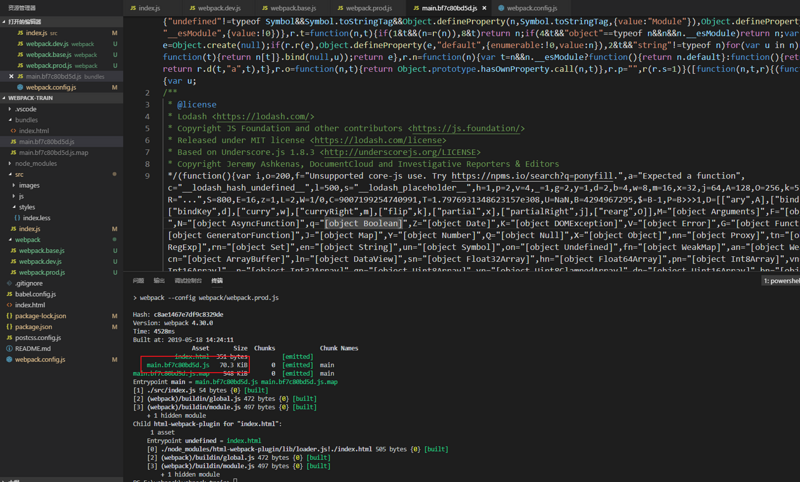

这里就会有个问题，项目中会引入很多第三方库，这些库根业务无关，内容几乎是不会改变的，如果都打包到一起，那么浏览器想要看到效果就必须执行完整个超大的main.js文件，如果能把不会变动的代码(不管是第三方还是自己写的)，都单独打包到一个文件，且文件名每次都一样，那么浏览器以后刷新就能直接在缓存中读取，从而提升页面性能，这就是所谓的代码分割。

## 手动实现代码分割

这里示范一下简单粗暴的做法，为了让大家更理解什么是代码分割
新建src/js/lodash.js
lodash.js代码如下：

```javascript
import _ from 'lodash';
window._ = _;
```

window上挂个属性'_'，值为lodash，这样index.js就不用引入了：
src/index.js:

```javascript
_.join(['a', 'b', 'c', '-']);
```

然后把lodash.js设置为入口，webpack/webpack.base.js:

```javascript
// 省略
entry: {
    main: './src/index.js',
    lodash: './src/js/lodash.js'
  },
//省略
```

执行npm run build:

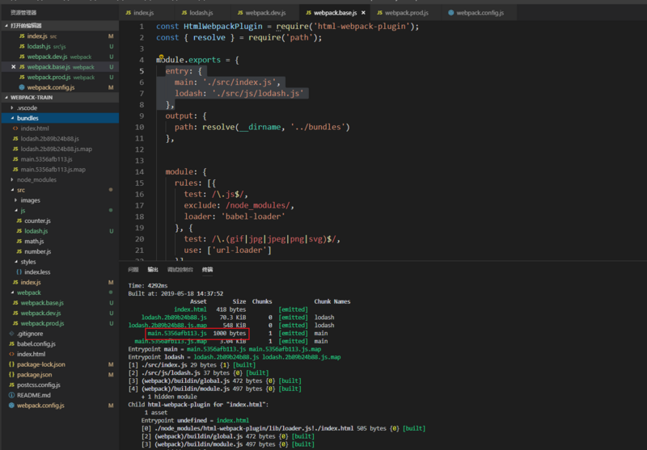

可以看到llodash被单独打包成了一个文件，这就是代码分割

## 用webpack实现代码分割

先恢复下代码，把src/js/lodash.js删了，
src/index.js如下:

```javascript
import _ from 'lodash';
_.join(['a', 'b', 'c', '-']);
```

webpack/webpack.base.js删掉lodash入口:

```javascript
// 省略
entry: './src/index.js',
//省略
```

这样代码就恢复了，代码分割的功能也没了。

然后在修改生产环境的配置，开启代码分割的选项
webpack/webpack.prod.js：

```javascript
// 省略
module.exports = merge(baseConfig, {
  mode: 'production',
  output: {
    filename: '[name].[contenthash:10].js'
  },
  devtool: 'cheap-module-source-map',
  module: {
    rules: [{
      test: /\.less$/,
      use: ['style-loader', 'css-loader', 'postcss-loader', 'less-loader']
    }]
  },
  plugins: [
    new CleanWebpackPlugin()
  ],
  optimization: {
    // 配置代码分割
    splitChunks: {
      // 要分割哪些模块：all（推荐）, async(默认，只分隔异步代码), and initial
      chunks: 'all'
    }
  }
});
```

然后npm run build:

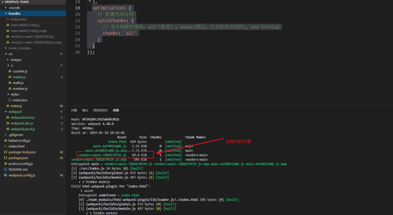


---


## 分割异步代码

之前src/index.js里都是同步代码：

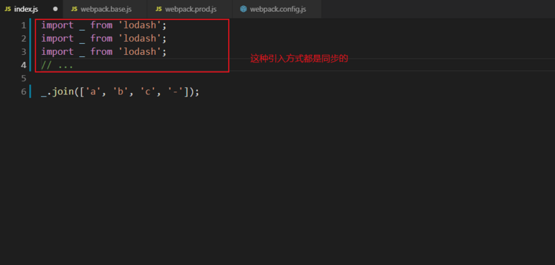

现在来写段异步逻辑，修改src/index.js:

```javascript
function getComponent() {
  const element = document.createElement('div');
  return import(/* webpackChunkName: "lodash" */ 'lodash').then(({ default: _ }) => {
    const element = document.createElement('div');
    element.innerHTML = _.join(['Hello', 'webpack'], ' ');
    return element;
  }).catch(error => 'An error occurred while loading the component');
}


// 按需加载，当点击了页面，才会引入lodash，也是单页应用路由懒加载的实现原理
window.addEventListener('click', function(){
 getComponent().then(component => {
    document.body.appendChild(component);
  })
});
```

import()可以不加载文件并返回promise,参考：[https://developer.mozilla.org...](https://developer.mozilla.org/zh-CN/docs/Web/JavaScript/Reference/Statements/import)

现在来npm run build:

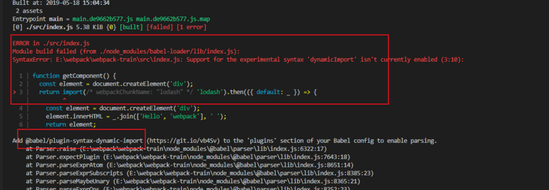
因为import()还只是个提案，我们得安装 @babel/plugin-syntax-dynamic-import插件才能用：
npm i @babel/plugin-syntax-dynamic-import -D

babel.config.js使用插件:

```javascript
module.exports = {
  presets: [
    ["@babel/env", {
      // 设置打包后的代码将在哪些浏览器运行？只针它们做转化
      targets: {
        edge: "17",
        firefox: "60",
        chrome: "67",
        safari: "11.1",
      },
  
      // 目前@babel/polyfill依赖的core-js@2，需要指定此选项并安装
      corejs: 2,
  
      /*
       * @babel/polyfill会将所有高阶语法转化，配置useBuiltIns只转化项目中用到的语法
       *797k => 291k
       * 当useBuiltIns: "usage"时，入口文件就不需要import "@babel/polyfill"了
       * 当useBuiltIns: "entry"时，需要在入口文件里import "@babel/polyfill"
       * */
      useBuiltIns: "usage"
    }
    ]
  ],
  plugins: ["@babel/plugin-syntax-dynamic-import"]
}
```

再次npm run build，和之前一样会进行代码分割

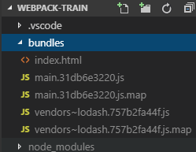

修改webpack/webpack.prod.js， 注释chunk属性：

```javascript
// 省略
 optimization: {
    // 配置代码分割
    splitChunks: {
      // 要分割哪些模块：all（推荐）, async(默认，只分隔异步代码), and initial
      // chunks: 'all'  
    }
  }
// 省略
```

再次npm run build，还是会代码分割，也就是chunks默认会对异步代码进行分割

当再把src/index.js改回同步代码，code spliting就失效了


---


前两节代码分割只用到了splitChunks中的chunks属性，现在来看下其它属性

## 魔法注释

先来打个包，npm run build：

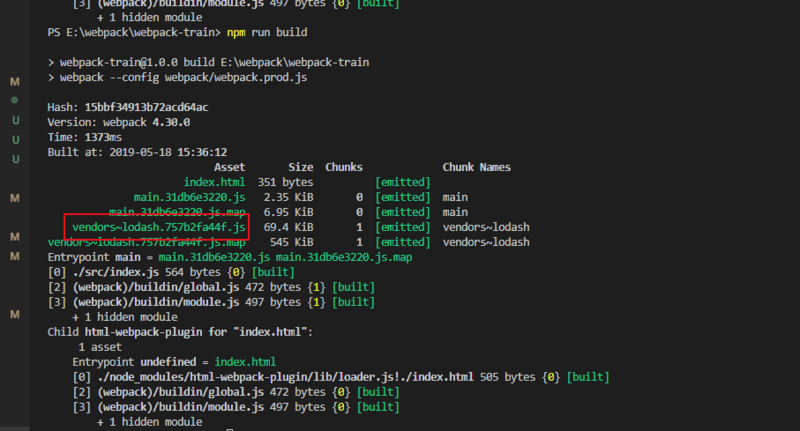

可以看到lodash打包后的名字是vendors~lodash，这其实跟src/index.js中的一段注释有关：

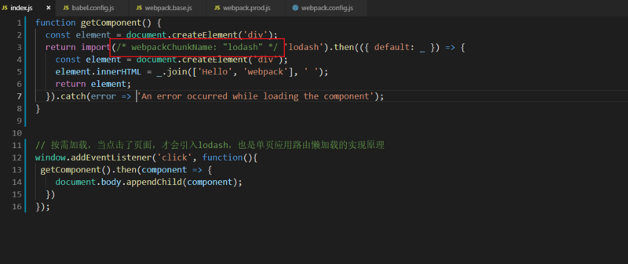

现在删掉这段注释再打包：

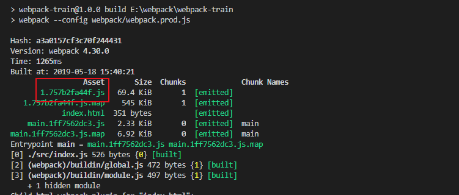

就默认用[id]命名了，这就是魔法注释的作用，还有其它魔法注释如：
/ *webpackPrefetch: true* / 这段表示改模块开启Prefetch预加载<link rel="prefetch" href="verdor~main.js">
/ *webpackPreload: true* / 这段表示改模块开启Preload预加载<link rel="preload" href="verdor~main.js">

## 修改输出文件名

虽然魔法注释能影响输出的文件名，但却不能完全控制，比如我就想让输出的文件名叫lodash呢？
先恢复魔法注释，然后修改webpack/webpack.prod.js:

```javascript
// 省略
optimization: {
    // 配置代码分割
    splitChunks: {
      cacheGroups: {
        vendors: false,
        default: false
      } 
    }
  }
// 省略
```

再打包：

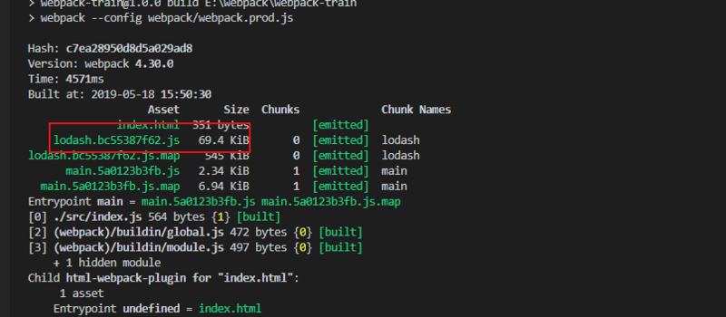
这样就没有vendor~前缀了。

## splitChunks其它属性

先看下splitChunks的默认属性：

```
module.exports = {
  //...
  optimization: {
    splitChunks: {
      chunks: 'async',
      minSize: 30000,
      maxSize: 0,
      minChunks: 1,
      maxAsyncRequests: 5,
      maxInitialRequests: 3,
      automaticNameDelimiter: '~',
      name: true,
      cacheGroups: {
        vendors: {
          test: /[\\/]node_modules[\\/]/,
          priority: -10
        },
        default: {
          minChunks: 2,
          priority: -20,
          reuseExistingChunk: true
        }
      }
    }
  }
};
```

属性很多，[官网传送](https://webpack.js.org/plugins/split-chunks-plugin)

这里注释一下这些默认属性的意思：

```
splitChunks: { // 代码分隔配置
       /*
       * 选择要进行分割的包
       * 可选值： all（推荐）, async(默认，只分隔异步代码), and initial(只分割同步代码)
       * 还可以传入函数精确控制
       * chunks (chunk) {
            // exclude `my-excluded-chunk`
            return chunk.name !== 'my-excluded-chunk';
          }
       * */
       chunks: 'all',

       // 默认，大于30k的包才做代码分割
       minSize: 30000,

       // 默认，分割出来的每个包最大size，
       // 比如设为50000（50kb），那如果某个包分离出来后超过50kb，就会进行再分割，保证每个文件都不超过50kb
       maxSize: 0,

       // 默认，至少被引入一次就进行代码分隔
       minChunks: 1,

       // 默认，浏览器最多并行请求5个js文件,也就是说，分割数量超过5个时，就会停止代码分割了
       maxAsyncRequests: 5,

       // 默认，对于入口文件最多只分割3个js包，超过3个就停止
       maxInitialRequests: 3,

       // 默认，文件名连接符
       automaticNameDelimiter: '~',

       // 默认，分割后的文件名将根据chunks和cacheGroups自动生成名称。
       name: true,

       cacheGroups: {
        vendors: {  // vendors是组名

          // 默认，只对node_modules里的代码进行分隔
          test: /[\\/]node_modules[\\/]/,

          /*
            默认，每个组都会有个优先级，
            如果某个包满足多个组的test规则，就按优先级来判断归哪个组
            数值越大，优先级越高
          */
          priority: -10,

          // 分割后的文件名（默认是：组名~入口名.js，即verdors~main.js）
          filename: 'vendors.js',

          // 强制分隔，无视minChunks、maxAsyncRequests等选项，默认false
          enforce: true
        }
      },


      default: {  // default是组名, 分隔不在node_modules里的代码
        minChunks: 2,   // 默认
        priority: -20,    // 默认

        /*
          复用已存在的chunk,
          比如index.js里引入axios和test.js
          test里也引入了axios，那么axios就会被复用
        */
        reuseExistingChunk: true
      },

      /*
      * 将项目所有css打包到一个文件中
      * 还可以分入口打包：https://webpack.js.org/plugins/mini-css-extract-plugin
      * */
      styles: {
        name: 'styles',
        test: /\.less$/,
        chunks: 'all',
        enforce: true,
      }
     }
   }
```

# webpack 懒加载

其实在代码分割时已经用过懒加载了，src/index.js内容如下：

```
function getComponent() {
  const element = document.createElement('div');
  return import(/* webpackChunkName: "lodash" */ 'lodash').then(({ default: _ }) => {
    const element = document.createElement('div');
    element.innerHTML = _.join(['Hello', 'webpack'], ' ');
    return element;
  }).catch(error => 'An error occurred while loading the component');
}


// 按需加载，当点击了页面，才会引入lodash，也是单页应用路由懒加载的实现原理
window.addEventListener('click', function(){
 getComponent().then(component => {
    document.body.appendChild(component);
  })
});
```

npm run build看生成的文件：

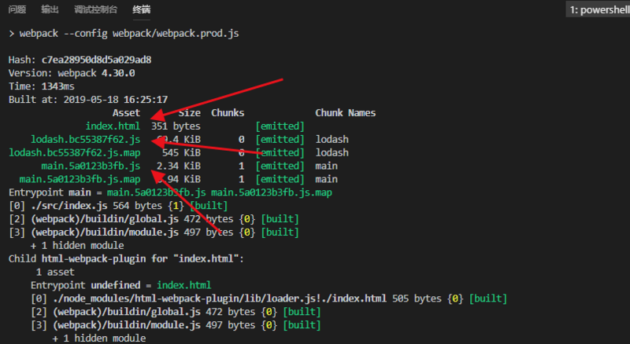
这三个文件将被用于浏览器，现在运行index.html打开f12:

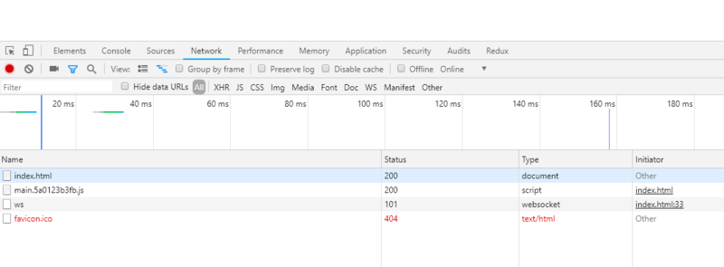

如果不点击页面，就不会加载lodash文件，现在点击一下页面：

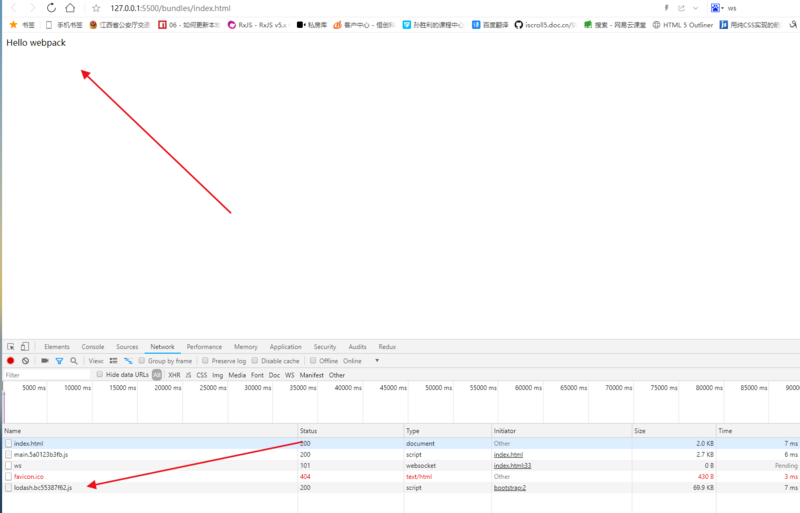

页面上出现hello webpack并且加载了lodash文件，这就是懒加载（按需加载 | 异步加载）