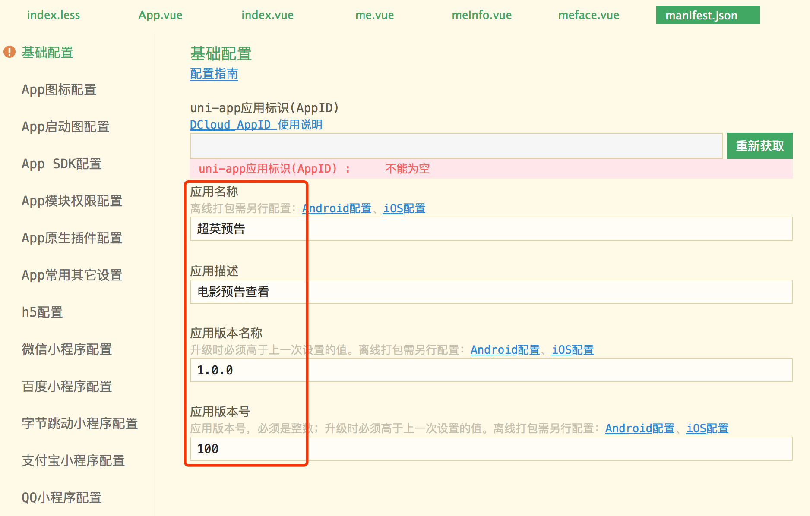

# uni-app 商业级应用实战

uni-app官网：https://uniapp.dcloud.io/

接口文档：https://www.imovietrailer.com/superhero/doc.html

## 优点

### 技能点

- 前后端分离
- 对接后端在线文档与接口
- uni-app

### 多端跨平台好处

- 多人工作1人完成，节省成本
- 创业型企业青睐
- 个人开发者接私活利器
- 毕业设计

## 技术点

## 开发风格

#### 页面代码分离

同一个页面将 `*.vue` 页面中的 js 和 css 部分拆分出去，最后在 `*.vue` 中引用：

> index.vue

```html
<template>
	<view class="page"></view>
</template>

<script>
	export default {}
</script>

<style lang="less" scoped>
	@import url("index.less");
</style>

```

> index.less

```css
.carousel {
	width: 100%;
	height: 440rpx;
	.swiper-item-image {
		width: 100%;
	}
}
```

#### common.js 存储通用代码

> common/index.js

```js
const serverURL = 'https://www.imovietrailer.com/superhero' // 生产环境

// 或者直接把 serverURL 挂载到 main.js 的 Vue.prototype 上去

export default {
	serverURL
}
```

> 调用

```js
import common from '@/common/index.js'
url: common.serverURL + '/index/carousel/list?&qq=843002185',
```


### UI样式

#### 禁用app+h5端顶部导航栏

在单独某个页面设置取消顶部导航栏：

> pages.json

```json
"pages": [ //pages数组中第一项表示应用启动页，参考：https://uniapp.dcloud.io/collocation/pages
		{
			"path": "pages/index/index",
			"style": {
				"app-plus": {
					"titleNView": false //禁用原生导航栏
				}, // uni-app 设置app-plus禁用导航栏后，默认h5也会被禁用，如果不希望h5端被禁用，可用 "h5" 配置做覆盖
			}
		},
    ...
]
```

文档链接：https://uniapp.dcloud.io/collocation/pages?id=customnav

#### 动画效果

```html
<view :animation="animationDataList[index]" class="praise-me animation-opacity">+1</view>
```

```css
.praise-me {
  font-size: 14px;
  color: #feab2a;
  align-self: center;
}
.animation-opacity {
  font-weight: bold;
  opacity: 0;
}
```

```js
data() {
			return {
				animationData: {}, // 点赞动画
				animationDataList: [], // 动画数组，存放单独的animationData对象
			}
		},
onLoad() {
  // 在页面创建的时候，创建一个临时动画对象
  this.animation = uni.createAnimation()
},
onUnload() {
  // 页面卸载时清除动画数据
  this.animationData = {}
  this.animationDataArr = []
},
methods: {
  praiseMe(e) {
    const self = this
    const index = e.currentTarget.dataset.index
    // 构建动画数据，并且通过 step 来表示这组动画的完成
    self.animation.translateY(-60).opacity(1).step({
      duration: 400
    })
    // 导出动画数据到view组件，实现组件的动画效果
    self.animationData = self.animation.export()
    // h5端直接索引会导致动画不执行，需要采用 Vue.$set 方式给数组下标位置赋值
    // self.animationDataList[index] = self.animationData
    self.$set(self.animationDataList, gIndex, self.animationData)
    // 还原动画
    setTimeout(function() {
      self.animation.translateY(0).opacity(0).step({
        duration: 0
      })
      self.animationData = self.animation.export()
      self.$set(self.animationDataList, gIndex, self.animationData)
    }.bind(self), 500);
  }
}
```

#### 沉浸式导航栏

> pages.json

```json
{
  "path" : "pages/movie/movie",
  "style" : {
    "app-plus": {
      "titleNView": {
        "type": "transparent" // 沉浸式导航栏（默认透明导航，上拉滚动逐渐显示导航栏）
      }
    }
  }
}
```

#### 通过API修改导航栏属性

```js
uni.setNavigationBarColor({
  frontColor: '#ffffff',
  backgroundColor: '#000000'
})
```


### 行为事件

#### 下拉刷新

在 pages.json 中配置某个页面开启下拉刷新

> pages.json

```json
"pages": [
		{
			"path": "pages/index/index",
			"style": {
				"app-plus": {
					"titleNView": false //禁用原生导航栏
				},
				"enablePullDownRefresh": true // 开启下拉刷新
			}
		},
    ...
]
```

页面中配置下拉刷新

> index.vue

```javascript
onPullDownRefresh() {
	this.refresh()
},
methods: {
  // 下拉刷新
  refresh() {
    const self = this

    uni.showLoading({
      title: '正在刷新',
      mask: true // 添加遮罩，在loading期间防止用户点击其他组件
    });
    // navigationbar 导航栏显示加载（如果在pages.json中设置了禁用原生导航栏，h5端就不会显示这个菊花loading，因为导航栏已经被干掉了）
    uni.showNavigationBarLoading()
    self.requestGuessULikeList(() => {
      uni.hideLoading()
      uni.hideNavigationBarLoading()
      uni.stopPullDownRefresh()
    })
  },
}
// 滚动条触底触发
onReachBottom() {
  const self = this
  self.page += 1

  // 如果当前需要分页的分页数大于总分页，则不操作
  if (self.page > self.totalPages) {
    return;
  }
  self.requestData()
}
```

#### 跳转传参

```javascript
uni.navigateTo({ // 跳转后左上角有返回按钮
	url: '../movie/movie?trailerId=' + trailerId
});
// uni.redirectTo({ // 跳转后不可返回
// 	url: '',
// });
// uni.switchTab({ // 切换底部tab
// 	url: '../me/me'
// })
```

```js
onLoad(payload) {
  const self = this
  self.trailerId = payload.trailerId
}
```

#### 图片预览

```html
<image v-for="(img, imgIndex) in plotPicsArray" :key="imgIndex"
       :src="img" @tap="lookMe" :data-imageIndex="imgIndex"
       class="plot-image" mode="aspectFill"
	></image>
```

```js
// 查看剧照的图片预览
lookMe(e) {
  var self = this
  var imageindex = e.currentTarget.dataset.imageindex
  var plotPicsArray = self.plotPicsArray
  uni.previewImage({
    urls: plotPicsArray,
    current: plotPicsArray[imageindex]
  });
},
```

#### 操作菜单

官方链接

- 操作菜单：https://uniapp.dcloud.io/api/ui/prompt?id=showactionsheet
- 下载：https://uniapp.dcloud.io/api/request/network-file?id=downloadfile
- 保存图片到系统相册：https://uniapp.dcloud.io/api/media/image?id=saveimagetophotosalbum （不支持h5）

```js
uni.showActionSheet({
  itemList: ['保存图片', '其他'],
  success: (res) => {
    console.log('图片:' + self.cover)

    const tapIndex = res.tapIndex
    if (tapIndex == 0) {
      //下载图片
      console.log('进入保存图片')
      uni.showLoading({
        title: '图片保存中...'
      });
      uni.downloadFile({
        url: self.cover, // 组件的 cover 属性，保存着图片路径
        success: (result) => {
          const tempFilePath = result.tempFilePath
          uni.saveImageToPhotosAlbum({ // 保存到本地（不支持h5）
            filePath: tempFilePath,
            success: () => {
              uni.showToast({
                title: '保存成功',
                duration: 2000
              });
            },
            complete() {
              uni.hideLoading()
            }
          });
        },
        fail: () => {
          uni.hideLoading()
        }
      });
    }
  }
});
```

#### 小程序端分享页面

官方文档：https://uniapp.dcloud.io/api/plugins/share?id=onshareappmessage

```js
// 只支持小程序端分享，分享到微信群或微信好友
onShareAppMessage(res) {
  const self = this
  return {
    title: self.trailerInfo.name,
    path: '/pages/movie/movie?trailerId=' + self.trailerInfo.id
  }
},
```

#### 分享到社交平台（微信、QQ、微博、短信、邮件等）

官方文档

- 分享到社交平台：https://uniapp.dcloud.io/api/plugins/share?id=share
- onNavigationBarButtonTap：https://uniapp.dcloud.io/api/lifecycle?id=%e9%a1%b5%e9%9d%a2%e7%94%9f%e5%91%bd%e5%91%a8%e6%9c%9f

> pages.json

```json
{
  "path" : "pages/movie/movie",
  "style" : {
    "app-plus": {
      "titleNView": {
        "type": "transparent" ,// 沉浸式导航栏
        "buttons": [
          {
            "type": "share"
          },
          {
            "type": "home"
          }
        ]
      }
    }
  }
}
```

##### 分享到朋友圈

```js
// 监听原生标题栏按钮点击事件
onNavigationBarButtonTap(e) {
  const self = this

  const index = e.index
  console.log("tap button:" + index)

  const trialerInfo = self.trailerInfo
  const {
    id: trailderID,
    name: trailerName,
    cover, poster,
    plotDesc: desc } = trialerInfo;

  uni.share({
    provider: "weixin",
    scene: "WXSenceTimeline", // 分享到朋友圈
    type: 0,
    href: "http://www.imovietrailer.com/#/pages/movie/movie?trailerId=" + trailderID,
    title: '超英预告：《' + trailerName + '》',
    summary: desc,
    imageUrl: cover,
    success: (res) => {
      console.log("分享成功" + res)
    }
  })
},
```

##### manifest.json 中配置


##### 微信开放平台申请应用的AppID获取

官方链接

- 腾讯开放平台：https://open.tencent.com/
- 微信开放平台：https://open.weixin.qq.com/

#### 视频组件控制

官方地址：https://uniapp.dcloud.io/api/media/video-context?id=createvideocontext

##### 暂停视频播放

```html
<video id="myTrailer"
	...
	class="movie" controls></video>
```

```js
// 页面初次渲染完成，获得视频上下文对象
onReady() {
  // 解决app端和小程序端播放视频后，再点击剧照放大时，后台还在播放视频
  this.videoContext = uni.createVideoContext('myTrailer')
},
onHide() {
  // 页面被隐藏的时候，暂停播放
  this.videoContext.pause()
},
onShow() {
  // 再次回到当前页面时再继续播放
  if (this.videoContext) {
    this.videoContext.play()
  }
},
```

#### 表单提交

##### 登录

```html
<template>
	<view class="body">
		<form @submit="formSubmit">
				<label class="words-lbl">账号</label>
				<input 
					type="text" value="" class="input" name="username"
          placeholder="请输入用户名" placeholder-class="graywords"
				/>
				<label class="words-lbl">密码</label>
				<input 
					type="text" value="" password="true" class="input"
          name="password" 
					placeholder="请输入密码" placeholder-class="graywords"
				/>
			<button type="primary" form-type="submit" class="loginbutton">注册登录</button>
		</form>
		<!-- 第三方登录 -->

		<!-- #ifndef H5 -->
		<view class="third-wapper">
			<view class="third-words">第三方账号登录</view>
			<view class="third-icons-wapper">
				<!-- 5+app 用qq/微信/微博 登录 小程序用微信小程序登录 h5不支持 -->
				
				<!-- #ifdef APP-PLUS -->
				<image src="/static/icos/weixin.png"
				 data-logintype="weixin" @click="appOAuthLogin" ></image>
				<image src="/static/icos/QQ.png"
				 data-logintype="qq" @click="appOAuthLogin" ></image>
				<image src="/static/icos/weibo.png"
				 data-logintype="sinaweibo" @click="appOAuthLogin" ></image>
				<!-- #endif -->
				
				<!-- #ifdef MP-WEIXIN -->
					<button open-type='getUserInfo' @getuserinfo="wxLogin" class="third-btn-ico">
					</button>
				<!-- #endif -->
			</view>
		</view>
		<!-- #endif -->
	</view>
</template>
```

```js
//注册登录
formSubmit(e){
  var me = this;
  var formData = e.detail.value;
  var username = formData.username;
  var password = formData.password;

  //发送注册登录请求
  uni.request({
    url:common.serverURL + "/user/registOrLogin?&qq=843002185",
    data:{
      "username": username,
      "password": password
    },
    method:"POST",
    success: (res) => {
      if(res.data.status == 200){
        var userInfo = res.data.data;
        //同步保存用户信息到全局中
        uni.setStorageSync("globalUser", userInfo);
        uni.switchTab({
          url:"../me/me"
        });
      } else if(res.data.status == 500){
        uni.showToast({
          title:res.data.msg,
          duration:2000,
          image:"/static/icos/error.png"
        });
      }
    },
    complete: () => {}
  });
},
```

#### 清除缓存

```js
clearCache(){
  // 清理缓存会删除所有数据,包括用户信息
  uni.clearStorageSync();
  uni.showToast({
    title:"清理缓存成功",
    duration:1500,
    mask:false
  });
},
```

#### 登录

官方文档：https://uniapp.dcloud.io/api/plugins/login?id=login

**说明**：

- H5不支持第三方登录，所以在三方登录时要把H5的情况排除

- 微信小程序（和App的微信登录不同）
- App三方登录

##### 微信小程序登录


**登录授权**：授权登录仍然要在 `manifest.json` 的「App SDK配置」中添加相应id码


```js
// 微信小程序登录
wxLogin(e) {
  var me = this;
  // 获取微信基本信息
  var userInfo = e.detail.userInfo;
  console.log(userInfo)
  // 实现微信登录
  uni.login({
    provider: "weixin",
    success: (loginResult) => {
      console.log(loginResult);
      // 获得微信登录的code：授权码
      var code = loginResult.code;
      // 设置登录到哪个对于的微信小程序，大家可以根据自己的后端去实现业务参数
      // [0:NEXT超英预告][1:超英预告][2:NEXT学院电影预告]
      var loginToWhichMP = 1;
      uni.request({
        url: common.serverURL + "/mpWXLogin/" + code + "?&qq=843002185",
        data: {
          "avatarUrl": userInfo.avatarUrl,
          "nickName": userInfo.nickName,
          "whichMP": loginToWhichMP,
          "qq":"843002185"
        },
        method: "POST",
        success(userResult) {
          console.log(userResult);
          var userInfo = userResult.data.data;
          // 保存用户信息到全局的缓存中
          uni.setStorageSync("globalUser", userInfo);
          // 切换页面跳转，使用tab切换的api
          uni.switchTab({
            url: "../me/me"
          });
        }
      });
    }
  });
}
```

##### app端第三方登录

文档

- 获取用户信息：https://uniapp.dcloud.io/api/plugins/login?id=getuserinfo

```js
// app上第三方登录
appOAuthLogin(e) {
  const self = this
  const logintype = e.currentTarget.dataset.logintype;
  uni.login({
    provider: logintype,
    success(loginRes) {
      // 授权登录成功以后，获取用户信息
      uni.getUserInfo({
        provider:logintype,
        success(info) {
          console.log(JSON.stringify(info))
          var userInfo = info.userInfo
          var face = ''
          var nickname = ''
          var openIdOrUid = ''
          if (logintype === 'weixin') {
            face = userInfo.avatarUrl
            nickname = userInfo.nickName
            openIdOrUid = userInfo.openId
          } else if (logintype === 'qq') {
            openIdOrUid = userInfo.openId
            nickname = userInfo.nickname
            face = userInfo.figureurl_qq_2
          } else if (logintype === 'sinaweibo') {
            openIdOrUid = userInfo.id
            nickname = userInfo.nickname
            face = userInfo.avatar_large
          }

          // 调用开发者后台，执行一键注册或登录
          uni.request({
            url: common.serverURL + '/appUnionLogin/' + logintype + '?&qq=843002185',
            data: {
              'openIdOrUid': openIdOrUid,
              'nickname': nickname,
              'face': face,
              'qq': '843002185'
            },
            method: 'POST',
            success(result) {
              if(result.data.status == 200){
                var userInfo = result.data.data;
                //同步保存用户信息到全局中
                uni.setStorageSync("globalUser", userInfo);
                uni.switchTab({
                  url:"../me/me"
                });
              }
            }
          })
        }
      })
    }
  })
},
```

#### 头像上传

地址：https://uniapp.dcloud.io/api/request/network-file?id=uploadfile

> 个人中心

```js
// 头像编辑
operator(){
  var me = this;
  var globalUser = me.getGlobalUser()
  uni.showActionSheet({
    itemList:["查看我的头像", "从相册选择上传"],
    success: (res) => {
      var index = res.tapIndex;
      if (index == 0) {
        // 查看我的头像
        var faceArr = [];
        faceArr.push(globalUser.faceImage);
        uni.previewImage({
          urls:faceArr,
          current:faceArr[0]
        });
      } else {
        //从相册选择上传
        uni.chooseImage({
          count:1,
          sizeType:["compressed"],
          sourceType:["album"],
          success: (res) => {
            // 获得临时路径
            var tempFilePath = res.tempFilePaths[0];

            uni.navigateTo({
              url:"../meface/meface?tempFilePath=" + tempFilePath
            });
          }
        });
      }
    }
  });
}
```

> 上传图片组件

```js
// 重新选择头像图片
changePedingFace(){
  var me = this;
  //从相册选择上传
  uni.chooseImage({
    count:1,
    sizeType:["compressed"],
    sourceType:["album"],
    success: (res) => {
      // 获得临时路径
      var tempFilePath = res.tempFilePaths[0];
      me.tempFace = tempFilePath;
    }
  });
},
// 开始上传
uploadFace(){
  var me = this;
  var globalUser = me.getGlobalUser();
  uni.showLoading({
    mask:true,
    title:"上传中, 请稍后"
  });

  console.log("===111====" + me.tempFace);
  uni.uploadFile({
    url:common.serverURL+"/user/uploadFace?userId=" + globalUser.id + "&qq=843002185",
    filePath:me.tempFace,
    name:"file",
    header:{
      "headerUserId": globalUser.id,
      "headerUserToken": globalUser.userUniqueToken
    },
    success: (resp) => {
      var resDataStr =resp.data;
      // 解析数据结构
      var resData = JSON.parse(resDataStr);

      if (resData.status == 200) {
        //获取最新的用户数据
        var userInfo = resData.data;
        uni.setStorageSync("globalUser", userInfo);
        uni.navigateBack({
          delta:1
        });
      } else if (resData.status === 502 || resData.status === 500) {
        uni.showToast({
          title: resData.msg,
          image: '../../static/icos/error.png',
          duration: 2000
        })
      }
    },
    complete() {
      uni.hideLoading();
    }
  });
}
```

## 打包发布

### h5发布

#### 在 manifest.json 中配置


在 HBuilderX 的发行——>网站-H5手机版 打包。

最后将打包好的路径 `unpackage/dist/build/h5` 下的文件上传到自己服务器上

### 微信小程序发布

#### 在 manifest.json 中配置


在 发行——>小程序微信 打包。

打包后自定启动微信小程序，点击上传发布。

微信小程序版本管理：https://mp.weixin.qq.com/wxamp/wacodepage/getcodepage

### App 发布

#### 在 manifest.json 中配置

> App SDK 配置

用到什么，就配相关功能的appid和secret


> 基础配置

**注意**：下方截图的uni-app应用表示（AppID）需要在注册 HBuilderX 账号后点击「重新获取」自动生成，打包时一定要有此ID，否则无法成功。



> app 图标配置


> 发行——>原生App云打包


> Apple打包

Apple打包需要一堆流程，可以选择打越狱包查看。这样就无需配置其他内容。

## 服务端配置

### 公司后端服务器域名配置

https://mp.weixin.qq.com/wxamp/devprofile/get_profile


## 坑

### 自定义组件 image 的 src 路径

自定义组件里面使用 `<image>`时，若 `src` 使用相对路径可能出现路径查找失败的情况，故建议使用绝对路径。

```html
<image
			src="/static/icos/star-yellow.png"
></image>
```

